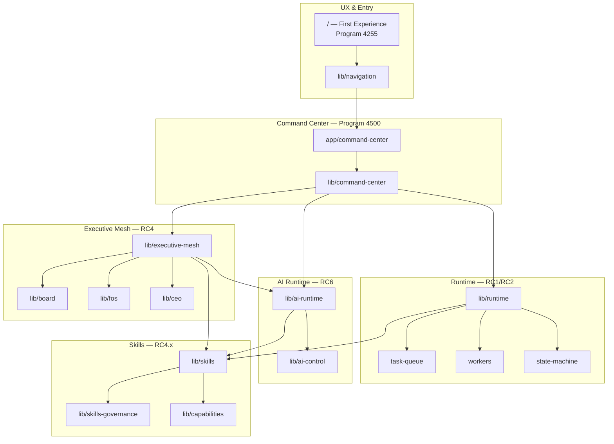
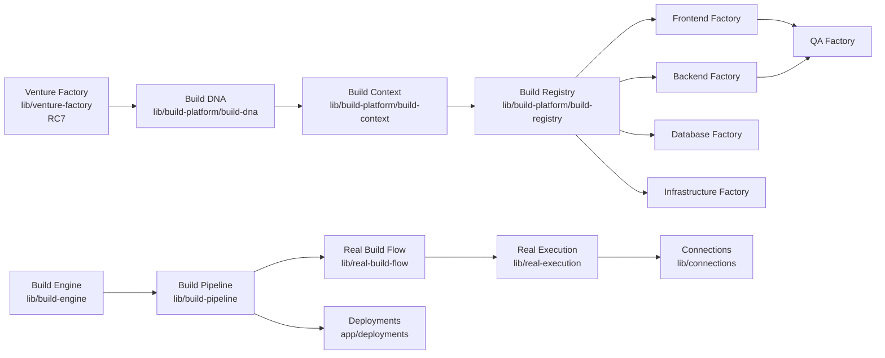
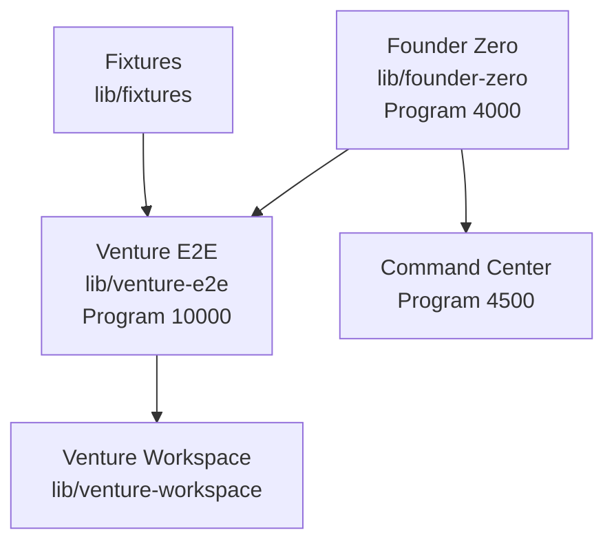
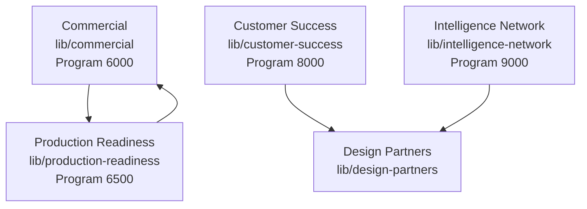

# Dependency Graph — Program 4290

ForgeOS system dependency chains. Downstream consumers must not be edited upstream without coordination.

## Mermaid — Core platform chain



## Mermaid — Build & deploy chain



## Mermaid — Founder validation chain



## Mermaid — Commercial & production



## ASCII — Simplified execution order

```
First Experience (4255)
    └── Navigation (4100)
            └── Command Center (4500)
                    ├── Executive Mesh (RC4)
                    │       ├── Board / FOS / CEO
                    │       └── AI Runtime (RC6)
                    │               └── Skills (RC4.x)
                    └── Runtime (RC1)
                            └── Workers / Task Queue

Venture Factory (RC7)
    └── Build DNA → Build Context → Build Registry
            └── Factories (FE/BE/DB/Infra/QA)
                    └── Build Engine → Build Pipeline
                            └── Real Build Flow → Real Execution
                                    └── Connections (RC5) → Deployments

Founder Zero (4000) → Venture E2E (10000) → Venture Workspace

Commercial (6000) ──┬── Production (6500)
Customer Success (8000) ──┬── Design Partners
Intelligence Network (9000) ──┘
```

## Dependency rules for agents

1. **Do not** modify downstream UI before upstream types stabilize
2. **Do not** add circular imports across Mesh ↔ AI Runtime ↔ Skills
3. **Prefer** read-only adapters (`lib/executive-mesh/adapters/`) over direct cross-engine calls
4. **Build chain** changes require Factories team + single integration build
5. **Navigation** changes require UX team after Command Center contract is honored

## Source references

- `lib/executive-mesh/adapters/ai-runtime-adapter.ts`
- `lib/real-build-flow/real-execution-bridge.ts`
- `lib/runtime/execution-engine/ai-orchestration-adapter.ts`
- `lib/command-center/summary-loader.ts` (compact snapshot — 4250)
