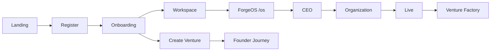

# Flujo unificado del fundador

## Diagrama

## Milestones

| ID | Ruta | Descripción |
|----|------|-------------|
| landing | `/landing` | Descubrimiento |
| register | `/register` | Cuenta + workspace Sprint 1 |
| onboarding | `/onboarding` | Wizard 6 pasos |
| workspace | `/workspace` | Centro de operaciones |
| venture-created | `/founder-journey` | Primera venture |
| ceo | `/os/ceo` | Briefing ejecutivo |
| organization | `/organization` | Equipo autónomo |
| live | `/live` | Operaciones en tiempo real |
| venture-factory | `/venture-factory` | Pipeline automático |

## Rutas legacy

`/founder` y `/creator` siguen activas. `FounderJourneyShell` muestra un banner con enlace a `/founder-journey`.

Configuración en `lib/founder-journey/redirects.ts`.

## Progreso

`computeJourneyProgress()` calcula el % completado según milestones marcados en `forgeos-founder-journey-progress`.

`markJourneyMilestoneFromPath(pathname)` se invoca automáticamente en el shell al navegar.

## Post-onboarding

1. Usuario llega a `/workspace` con Welcome Dashboard
2. CTA principal: **Abrir ForgeOS** → `/os`
3. Enlaces rápidos: Founder Journey, Venture Factory, CEO

## Coexistencia

- Epic 7.1 (`computeFounderJourney`) — fases de venture existentes
- Sprint 2 — onboarding y milestones del recorrido fundador
- Runtime, AI Runtime, Executive Mesh, Skills y Venture Factory no se modifican
