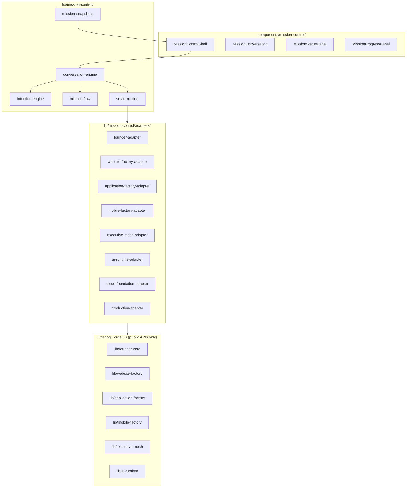

# Mission Control Architecture

## Layer diagram

## SSR snapshot strategy

| Layer | Load time | Imports |
|-------|-----------|---------|
| `app/mission-control/page.tsx` | SSR | `buildMissionControlSnapshot()` only |
| `MissionControlShell` | Client dynamic | conversation-engine, persistence |
| Factory adapters | On demand | `import()` when user starts BUILD phase |
| Executive mesh | On important decision | summary adapter, no chain-of-thought |

## What Mission Control does NOT do

- Does not modify `lib/runtime/`, `lib/executive-mesh/`, `lib/ai-runtime/`, or `lib/skills/` internals
- Does not duplicate factory pipeline logic
- Does not expose executive reasoning chains
