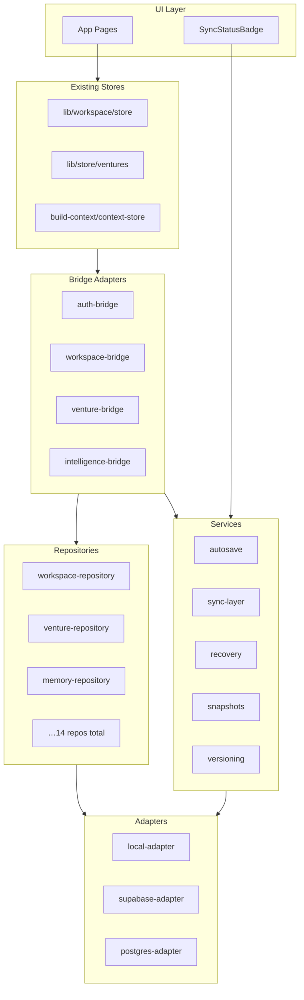

# Persistence Architecture

## Design principles

1. **Repository Pattern** — all data access goes through typed repository interfaces in `lib/persistence/repositories/`.
2. **Adapter abstraction** — repositories depend on `PersistenceAdapter`, not on localStorage or Supabase directly.
3. **Backward compatibility** — storage keys match existing Sprint 1/2 localStorage keys so existing user data is preserved.
4. **Minimal surface change** — existing stores (`lib/workspace/store.ts`, `lib/store/ventures.ts`) keep their public API; bridges handle delegation.
5. **No direct DB in components** — UI code imports stores or hooks, never `@supabase/supabase-js` or raw `fetch` to a database.

## Layer diagram

## Data flow — write path

1. Component calls `saveVenture(venture)` (existing API).
2. `venture-bridge` writes to localStorage synchronously (instant UI feedback).
3. Bridge schedules debounced autosave to repository.
4. Repository writes via active adapter.
5. If remote provider is configured, sync-layer pushes to Supabase/Postgres on interval.

## Data flow — read path

1. Component calls `getVentures()` (existing API).
2. Bridge reads from localStorage (sync, fast).
3. Async repository reads available for hydration on app init.

## Provider resolution

`resolveActiveProvider()` in `lib/persistence/config.ts`:

1. Read `PERSISTENCE_PROVIDER` or `NEXT_PUBLIC_PERSISTENCE_PROVIDER`.
2. If `supabase` and `SUPABASE_URL` + key are set → use Supabase adapter.
3. If `postgres` and `DATABASE_URL` is set → use Postgres adapter.
4. Otherwise → fall back to local adapter.

## Bridge mapping

| Bridge | Wired modules |
|--------|--------------|
| `auth-bridge` | `lib/workspace/store` (users), `lib/auth` |
| `workspace-bridge` | `lib/workspace/store`, `lib/workspace/service` |
| `venture-bridge` | `lib/store/ventures` |
| `intelligence-bridge` | memory, decisions, CEO memory, build context/DNA, timeline, knowledge hub |

## IndexedDB fallback

The local adapter automatically routes payloads larger than 512 KB to IndexedDB (`forgeos-persistence` database) to avoid localStorage quota errors.

## Versioning & snapshots

- **Versioning** records entity snapshots on each save (max 20 per entity).
- **Snapshots** capture full venture state across all key storage keys (max 10 snapshots).

Both are client-side only in Sprint 3; remote backup is handled by the sync layer when a remote provider is active.
