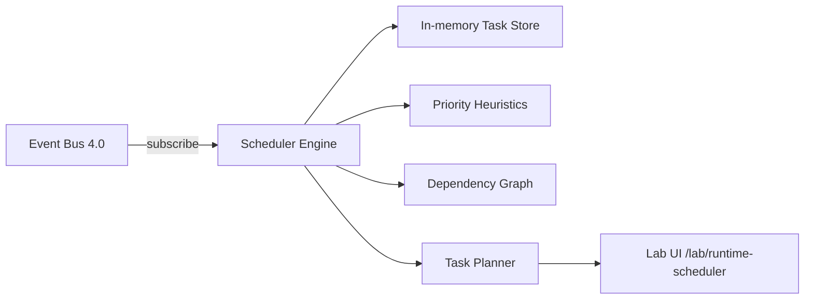

# Epic 4.1 — Runtime Scheduler

**Program:** 1 — ForgeOS Runtime  
**Location:** `lib/runtime/scheduler/`  
**Lab:** `/lab/runtime-scheduler`

## Objective

Provide a central scheduler that listens to the Runtime Event Bus (Epic 4.0), converts signals into typed tasks, assigns priorities, resolves dependencies, transitions status, and generates an execution plan. **No worker execution** in this epic.

## Architecture



Components:

| Module | Role |
|--------|------|
| `scheduler.ts` | Main engine; subscribes to bus, ingests events |
| `scheduler-store.ts` | In-memory task persistence |
| `priority.ts` | P0–P3 assignment rules |
| `dependencies.ts` | Venture-scoped dependency resolution |
| `task-status.ts` | Status transitions (pending → ready/blocked/…) |
| `task-planner.ts` | Topological ordering + execution waves |

## Task types

- `DISCOVERY_REVIEW`
- `RESEARCH_RUN`
- `PRODUCT_UPDATE`
- `CEO_REVIEW`
- `BOARD_REVIEW`
- `SIMULATOR_UPDATE`
- `BUILD_PLAN_UPDATE`
- `MEMORY_WRITE`
- `RISK_REVIEW`
- `OPPORTUNITY_REVIEW`

## Priority heuristics

| Signal | Priority |
|--------|----------|
| Critical risk / blocked venture | **P0** |
| Pending decision / incomplete research | **P1** |
| Incomplete product / pending memory | **P2** |
| General improvements (simulator, low-impact opportunity) | **P3** |

Implementation: `lib/runtime/scheduler/priority.ts`

## Dependencies (calculate only)

Static rules per venture:

| Task | Depends on |
|------|------------|
| `PRODUCT_UPDATE` | `RESEARCH_RUN` |
| `BUILD_PLAN_UPDATE` | `PRODUCT_UPDATE` |
| `BOARD_REVIEW` | `CEO_REVIEW` |
| `SIMULATOR_UPDATE` | `PRODUCT_UPDATE` |
| BUILD (future) | `BOARD_REVIEW` + `BUILD_PLAN_UPDATE` |

Dependencies are resolved to concrete task IDs within the same `ventureId`. Status becomes `blocked` until all dependency tasks reach `completed`.

## Event Bus integration

Subscribed events (direct import from `lib/runtime/event-bus/`):

- `VENTURE_CREATED` → `DISCOVERY_REVIEW`
- `DISCOVERY_COMPLETED` → completes discovery, creates `RESEARCH_RUN`
- `RESEARCH_COMPLETED` → completes research, creates `PRODUCT_UPDATE` + `SIMULATOR_UPDATE`
- `CEO_DECISION_CREATED` → `CEO_REVIEW` (recorded as completed)
- `BOARD_CONSENSUS_REACHED` → `BOARD_REVIEW` (completed) + `BUILD_PLAN_UPDATE`
- `RISK_DETECTED` → `RISK_REVIEW`
- `OPPORTUNITY_DETECTED` → `OPPORTUNITY_REVIEW`
- `MEMORY_UPDATED` → `MEMORY_WRITE` (completed on ingest)

```typescript
import { createRuntimeEventBus } from "@/lib/runtime/event-bus/event-bus";
import { connectSchedulerToEventBus, createRuntimeScheduler } from "@/lib/runtime/scheduler/scheduler";

const bus = createRuntimeEventBus();
const scheduler = connectSchedulerToEventBus(createRuntimeScheduler(), bus);
```

## Lab console

Route: `/lab/runtime-scheduler` (no main nav link)

Features:

- Mock event buttons for all subscribed event types
- Demo sequence (full venture lifecycle)
- Task table with priority, status, dependencies
- Ready vs blocked panels
- Execution plan waves

Uses FHIS components only (`Panel`, `Badge`, `Status`, `Button`, `Layout`).

## Current limits

- In-memory only; no persistence across server restarts
- No worker dispatch or Execution Engine (Epic 4.5)
- No Dashboard or CEO Office wiring
- BUILD task type not modeled yet (dependency rule documented for future)
- `running` / `failed` statuses defined but not driven by real execution

## Isolation

- Does **not** modify Dashboard, CEO Office, Research, Product, Build Engine, or AI Orchestration
- Does **not** add main navigation entries
- Imports Event Bus via direct file paths (no heavy barrels)

## Next steps

1. **Epic 4.2** — Venture State Machine: align task status with venture lifecycle states
2. **Epic 4.4** — Task Queue: dequeue ready tasks from scheduler plan
3. **Epic 4.5** — Execution Engine: transition `ready` → `running` → `completed`/`failed`
4. Model BUILD tasks when `BUILD_REQUESTED` integration is scoped
5. Optional persistence layer for scheduler store
