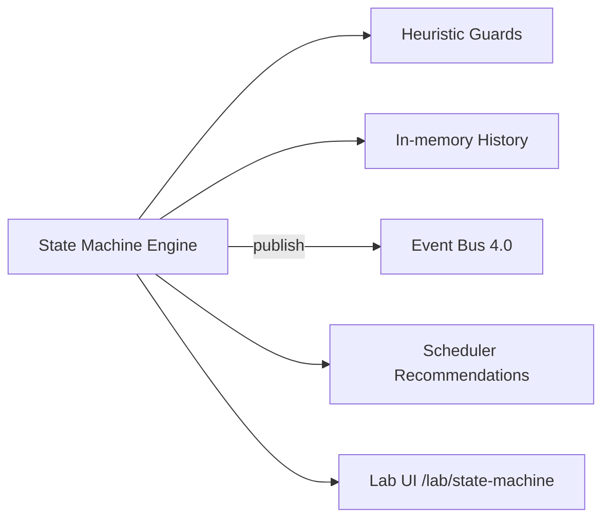

# Epic 4.2 — Venture State Machine

**Program:** 1 — ForgeOS Runtime  
**Location:** `lib/runtime/state-machine/`  
**Lab:** `/lab/state-machine`

## Objective

Provide the official venture lifecycle state machine: centralized states, transitions, heuristic guards, in-memory history, Event Bus emission, and scheduler task recommendations. **No worker execution** and **no Dashboard connection** in this epic.

## Architecture



Components:

| Module | Role |
|--------|------|
| `states.ts` | Official state definitions and labels |
| `transitions.ts` | Linear pipeline + special-state rules |
| `guards.ts` | Heuristic allow/block with requirements |
| `history.ts` | In-memory transition history |
| `state-events.ts` | Event Bus emission helpers |
| `scheduler-suggestions.ts` | Task recommendations (no execution) |
| `state-machine.ts` | Main engine: `getState`, `canTransition`, `transition` |

## Official states

Linear: `IDEA` → `DISCOVERY` → `RESEARCH` → `PRODUCT` → `ARCHITECTURE` → `UX` → `BUILD` → `QA` → `LAUNCH` → `GROWTH` → `SCALE` → `CAPITAL` → `EXIT`

Special: `PAUSED`, `BLOCKED`, `ARCHIVED`

- Any active state → `PAUSED`, `BLOCKED`, `ARCHIVED`
- `PAUSED` → previous active state
- `BLOCKED` → previous active state when `blockResolved` is true

## Guards (heuristic)

| Target | Requirement |
|--------|-------------|
| `RESEARCH` | Discovery has content |
| `PRODUCT` | Research complete |
| `BUILD` | Product PRD exists |
| `LAUNCH` | QA complete |
| `CAPITAL` | Minimum metrics met |

Returns: `{ allowed, reason, missingRequirements[], warnings[] }`

## Event Bus integration

New events (Epic 4.2):

- `VENTURE_STATE_CHANGED` — every successful transition
- `VENTURE_PAUSED` / `VENTURE_BLOCKED`
- `VENTURE_READY_FOR_BUILD` / `VENTURE_READY_FOR_LAUNCH` / `VENTURE_READY_FOR_CAPITAL`

```typescript
import { createRuntimeEventBus } from "@/lib/runtime/event-bus/event-bus";
import { createVentureStateMachine } from "@/lib/runtime/state-machine/state-machine";

const bus = createRuntimeEventBus();
const machine = createVentureStateMachine({}, bus);
```

## Scheduler integration (recommendations only)

| Transition from | Suggested task |
|-----------------|----------------|
| `DISCOVERY` | `RESEARCH_RUN` |
| `RESEARCH` | `PRODUCT_UPDATE` |
| `PRODUCT` | `BUILD_PLAN_UPDATE` |
| `BUILD` | `QA_CHECK` (recommendation string) |
| `QA` | `LAUNCH_PREP` (recommendation string) |

`QA_CHECK` and `LAUNCH_PREP` are documented recommendation strings — not yet in `SchedulerTaskType` (Epic 4.1). Scheduler types unchanged to avoid breaking existing consumers.

## Lab console

Route: `/lab/state-machine` (no main nav link)

Features:

- Select mock venture profiles with different guard contexts
- View current state and resume target
- Preview guard allow/block before transition
- Attempt transition and view result
- Transition history
- Emitted Event Bus events
- Suggested scheduler tasks

Uses FHIS components only (`Panel`, `Badge`, `Status`, `Button`, `Layout`).

## Current limits

- In-memory only; no persistence across server restarts
- Guards are heuristic; callers supply `VentureStateContext`
- No worker dispatch or Execution Engine (Epic 4.5)
- No Dashboard or CEO Office wiring

## Isolation

- Does **not** modify Dashboard, CEO Office, Research, Product, Build Engine, or AI Orchestration
- Does **not** add main navigation entries
- Direct imports from `event-bus/` and `scheduler/types` only

## Next steps

1. **Epic 4.3** — Worker Runtime: execute scheduler recommendations
2. **Epic 4.4** — Task Queue: dequeue from scheduler plan
3. **Epic 4.5** — Execution Engine: wire state machine + scheduler + workers
4. Add `QA_CHECK` / `LAUNCH_PREP` to scheduler types when worker mapping is scoped
5. Optional persistence for venture state and history
