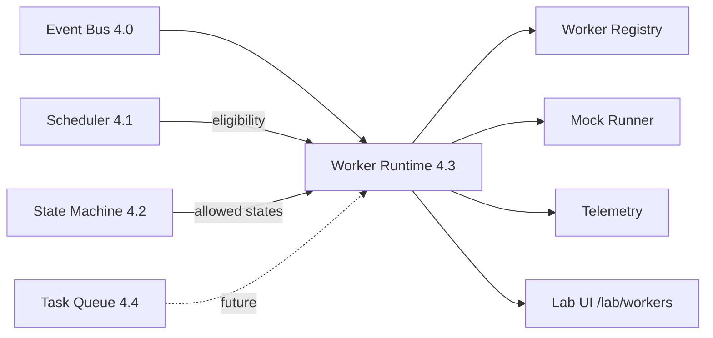

# Epic 4.3 — Worker Runtime

**Program:** 1 — ForgeOS Runtime  
**Location:** `lib/runtime/workers/`  
**Lab:** `/lab/workers`

## Objective

Provide official department execution units governed by Event Bus → Scheduler → State Machine → Worker Runtime. **Mock execution only** — no real AI orchestration in this epic.

## Architecture

## Workers (20 departments)

CEO, Research, Product, UX, Architecture, CTO, Backend, Frontend, Database, QA, Marketing, Growth, Finance, Legal, Operations, Support, Capital, Knowledge, Analytics, Build, Deployment.

Each worker declares:

- `id`, `name`, `description`, `department`
- `capabilities`, `priority`, `requiredContext`
- `allowedStates` (venture lifecycle)
- `supportedTasks`, `health`, `status`, `version`

## Worker status states

`IDLE`, `WAITING`, `READY`, `RUNNING`, `BLOCKED`, `PAUSED`, `FAILED`, `COMPLETED`, `OFFLINE`, `DEPRECATED` — all transitions recorded.

## Health levels

`HEALTHY`, `WARNING`, `DEGRADED`, `CRITICAL`, `OFFLINE` — tracks last execution, errors, avg time, successes, failures.

## Event Bus integration

New category: `worker`

| Event | When |
|-------|------|
| `WORKER_REGISTERED` | Worker added to registry |
| `WORKER_STARTED` | Mock run begins |
| `WORKER_COMPLETED` | Mock run succeeds |
| `WORKER_FAILED` | Mock run fails |
| `WORKER_BLOCKED` | Validation blocked execution |
| `WORKER_PAUSED` | Worker paused |
| `WORKER_RESUMED` | Worker resumed |
| `WORKER_HEALTH_CHANGED` | Health level changed |

## Adapters

| Adapter | Role |
|---------|------|
| `scheduler-adapter.ts` | Who can execute task? priority? missing deps? |
| `state-machine-adapter.ts` | Worker `allowedStates` vs current venture state |
| `eventbus-adapter.ts` | Publish worker lifecycle events |
| `queue-adapter.ts` | **Stub** for Epic 4.4 |

## Runner flow

1. Receive task request
2. Validate state machine eligibility
3. Validate capabilities and supported tasks
4. Check scheduler eligibility (no auto-execution)
5. Emit Event Bus signals
6. Record telemetry
7. Return mock result

## Lab

`/lab/workers` — table of all workers, metrics, timeline, telemetry. **Ejecutar Mock** traverses full runtime without AI.

## Constraints

- Direct imports from `lib/runtime/*` — no heavy barrels
- No Dashboard / Mission Control coupling
- Task Queue deferred to Epic 4.4

## Next

**Epic 4.4 — Task Queue** (`lib/runtime/task-queue/`)
