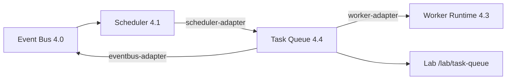

# Epic 4.4 — Task Queue

**Program:** 1 — ForgeOS Runtime  
**Location:** `lib/runtime/task-queue/`  
**Lab:** `/lab/task-queue`

## Objective

Official task queue — heart of the ForgeOS Runtime. No worker executes directly; flow:

**Event Bus → Scheduler → Task Queue → Worker Runtime → (Epic 4.5 Execution Engine) → Memory**

No real task execution in this epic.

## Architecture

## Official states

`PENDING`, `READY`, `WAITING`, `BLOCKED`, `RUNNING`, `COMPLETED`, `FAILED`, `CANCELLED`, `TIMEOUT`, `RETRYING`, `DEAD_LETTER`

## Priorities

| Priority | Weight | Timeout | Max retries |
|----------|--------|---------|-------------|
| P0_CRITICAL | 1000 | 60s | 5 |
| P1_HIGH | 750 | 120s | 5 |
| P2_MEDIUM | 500 | 300s | 3 |
| P3_LOW | 250 | 600s | 3 |

## Pipeline dependencies (calculate only)

| Task | Requires milestone |
|------|-------------------|
| BUILD | PRODUCT_COMPLETE |
| QA | BUILD_COMPLETE |
| LAUNCH | QA_COMPLETE |

Milestones are satisfied when the corresponding task type (`PRODUCT_UPDATE`, `BUILD`, `QA`) reaches `COMPLETED`.

Scheduler task-type dependencies from Epic 4.1 are also resolved.

## Retry policies

`NO_RETRY`, `LINEAR`, `EXPONENTIAL`, `MAX_3`, `MAX_5` — track attempts, last error, last execution. Auto dead-letter when max retries exceeded.

## Dead letter

Records: cause, worker, venture, task, date. Tasks transition to `DEAD_LETTER` status.

## Registry

`create`, `find`, `filter`, `cancel`, `query`, `update`, `history` via `task-registry.ts`.

## Event Bus events (category: `task`)

- `TASK_CREATED`, `TASK_READY`, `TASK_STARTED`, `TASK_COMPLETED`
- `TASK_FAILED`, `TASK_RETRY`, `TASK_CANCELLED`, `TASK_DEAD_LETTER`, `TASK_TIMEOUT`

## Adapters

| Adapter | Role |
|---------|------|
| `scheduler-adapter.ts` | Plan scheduler tasks into queue; next task, priority, deps, recommended worker |
| `worker-adapter.ts` | Query: are there tasks? can I execute? are they blocked? |
| `eventbus-adapter.ts` | Publish TASK_* lifecycle events |
| `workers/queue-adapter.ts` | Wired to real task queue (replaces stub) |

## Metrics & telemetry

Counts (pending/running/completed/failed/dead letter), avg/max wait and execution time, recommended worker distribution, queue position, latency, retry/failure/warning counts.

## Epic 4.5 prep

Execution Engine will consume `getNextTask`, call `updateStatus` (RUNNING → COMPLETED/FAILED), and integrate with Memory writes. Worker adapter queries remain read-only until 4.5 orchestrates execution.
