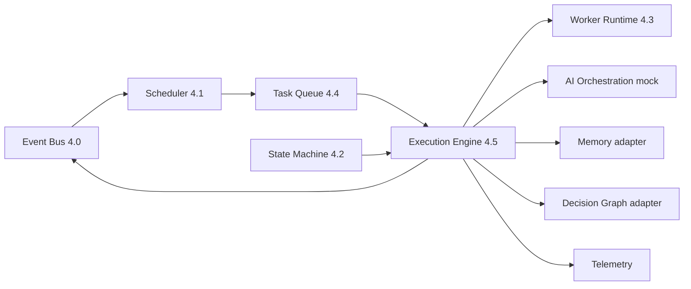

# Epic 4.5 — Runtime Execution Engine RC1

**Program:** 1 — ForgeOS Runtime  
**Location:** `lib/runtime/execution-engine/`  
**Lab:** `/lab/execution-engine`

## Objective

Central execution engine completing the **Runtime Kernel RC1**. Full mock flow:

```
Event Bus → Scheduler → Task Queue → Execution Engine → Worker Runtime
  → (mock AI Orchestration) → Memory → Decision Graph → Telemetry
```

No Dashboard dependency. Mock only — **no real automatic AI**.

## Architecture



## Pipeline states

`READY` → `DISPATCHED` → `VALIDATED` → `RUNNING` → `FINISHED` → `COMPLETED`

On failure: `FAILED` → `RETRY` → `DEAD_LETTER`

## Execution session

`sessionId`, `ventureId`, `workerId`, `taskId`, `startedAt`, `finishedAt`, `status`, `duration`, `warnings`, `errors`, `events`, `memoryWrites`, `decisionWrites`

## Worker dispatcher

Auto-selects compatible worker by capability, status, priority, and availability. If none available → `WorkerUnavailable` (runtime continues without breaking).

## State machine validation

- Research worker blocked on `EXIT`, `ARCHIVED`, `CAPITAL`
- Build worker blocked if research or product incomplete
- Uses state machine + venture context flags

## Event Bus (category: `execution`)

- `EXECUTION_STARTED`, `EXECUTION_FINISHED`, `EXECUTION_FAILED`
- `WORKER_DISPATCHED`, `TASK_EXECUTED`
- `SESSION_CREATED`, `SESSION_FINISHED`

## Memory & decision graph

In-memory stores update execution history, worker history, and task history. Adapters mirror executive memory / decision graph patterns without modifying orchestration core.

## Metrics & telemetry

Execution time, worker usage, avg runtime, failures, retries, queue wait, scheduler delay, provider, model, latency, fallback, warnings.

## Future adapters (stubs)

AI Runtime, Build Engine, Marketing, Finance, Legal, Capital — Coming Soon.

## Components

| File | Role |
|------|------|
| `execution-engine.ts` | Main orchestrator |
| `execution-runner.ts` | Single execution cycle |
| `execution-pipeline.ts` | Pipeline state machine |
| `worker-dispatcher.ts` | Worker auto-selection |
| `task-dispatcher.ts` | READY task selection |
| `scheduler-adapter.ts` | Scheduler consultation |
| `queue-adapter.ts` | Queue read/write |
| `worker-adapter.ts` | Worker runner bridge |
| `eventbus-adapter.ts` | Execution events |
| `memory-adapter.ts` | In-memory memory writes |
| `decision-graph-adapter.ts` | In-memory decision writes |
| `ai-orchestration-adapter.ts` | Mock AI only |

## Runtime Kernel RC1

With Epic 4.5 complete, Program 1 Runtime Kernel RC1 is **complete**. Next: **Program 2 — Build Platform**.
