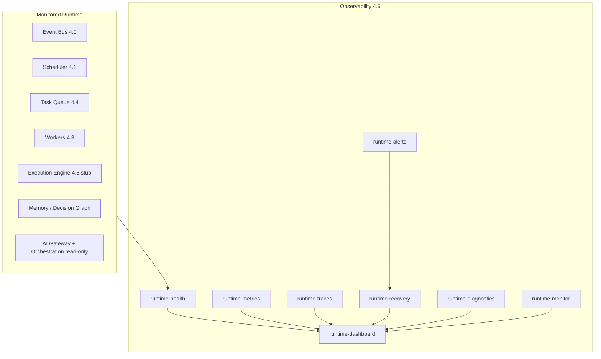

# Epic 4.6 — Runtime Observability & Self-Healing RC1

**Program:** 1 — ForgeOS Runtime  
**Location:** `lib/runtime/observability/`  
**Lab:** `/lab/runtime-observability`

## Objective

Observability, monitoring, and recovery planning for the ForgeOS Runtime kernel. Makes the runtime observable, auditable, recoverable, and enterprise-ready.

**No new user-facing product features.** No Dashboard, Mission Control, Build Platform, or Creator Flow changes.

## Architecture

## Health levels

`HEALTHY`, `WARNING`, `DEGRADED`, `CRITICAL`, `OFFLINE`

| Component | Source |
|-----------|--------|
| Event Bus | `event-bus/event-bus.ts` |
| Scheduler | `scheduler/scheduler.ts` |
| Task Queue | `task-queue/task-queue.ts` |
| Worker Runtime | `workers/worker-registry.ts` |
| Execution Engine | Live when wired via `executionEngine` in context (Epic 4.5) |
| Memory | `ai-orchestration/executive-memory-writer.ts` |
| Decision Graph | `ai-orchestration/decision-graph-writer.ts` |
| AI Gateway | `ai-gateway/registry.ts` (read-only) |
| AI Orchestration | `ai-orchestration/observability.ts` (read-only) |

## Traces

Full pipeline: **Event → Scheduler → Queue → Worker → Execution → Memory → Finished**

In-memory store with timestamps, latency, errors, and warnings per span.

## Metrics

Uptime, average latency, task throughput, active/blocked workers, errors, retries, dead letters, average worker execution time, AI usage, estimated cost.

## Alerts

| Type | Level range |
|------|-------------|
| Worker Offline | CRITICAL |
| Queue Saturated | WARNING–CRITICAL |
| Scheduler Stopped | ERROR |
| Execution Blocked | ERROR |
| AI Provider Slow | WARNING |
| Memory Inconsistent | WARNING |

## Self-healing (recovery plan only)

Actions are **proposed only** — never auto-executed:

- Restart Worker
- Retry Task
- Clear Blocked Queue
- Clean Orphan Session
- Re-emit Event

## Diagnostics (report only)

- Circular import heuristics
- Unregistered workers
- Inconsistent queues
- Broken dependencies (execution engine stub)
- Missing adapters (scheduler → queue)
- High latency (queue + AI)
- Unresponsive providers

## Execution Engine integration

Epic 4.5 module exists at `lib/runtime/execution-engine/`. Observability integrates via optional `executionEngine` on `RuntimeObservabilityContext`. The lab monitor wires it automatically; standalone probes without wiring report `OFFLINE`/`WARNING`.

## Lab

`/lab/runtime-observability` — FHIS components only. Shows overall health, component map, workers, queue, scheduler, execution engine status, events, alerts, errors, recovery plan, profiler, trace timeline.

## Program 1 status

Epic 4.6 completes **Program 1 — ForgeOS Runtime**. Next: **Program 2 — Build Platform**.
