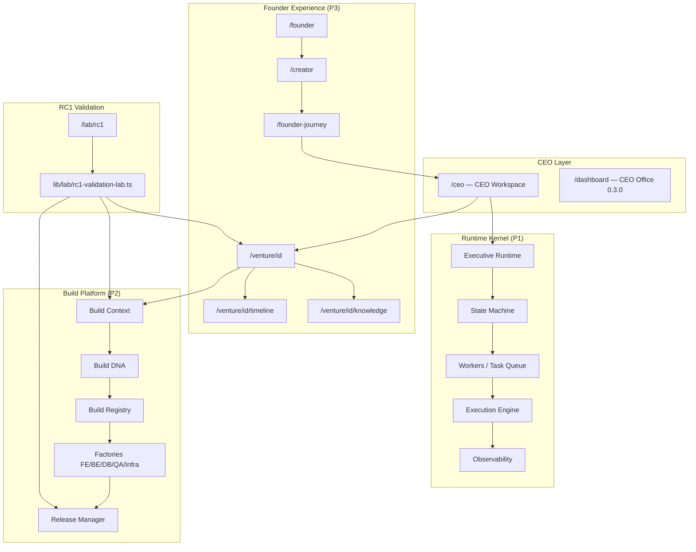

# ForgeOS RC1 — Architecture

## Vista general

ForgeOS RC1 integra tres programas en una plataforma coherente orientada al recorrido del fundador.

## Capas

### Runtime (Program 1)

Motor de ejecución ejecutivo: CEO + Board + Consensus + Decision Graph. Labs en `/lab/executive-runtime` y subsistemas (workers, task-queue, execution-engine, observability).

### Build Platform (Program 2)

Pipeline de construcción: contexto → ADN → registro → factories → release manager. Cada epic expone un lab en `/lab/*`.

### Founder Experience (Program 3)

Experiencia del fundador: captura de idea, journey de 15 fases, workspace por venture, timeline y knowledge hub.

## Datos

| Store | Ubicación | Alcance |
|-------|-----------|---------|
| Ventures | `localStorage` (`forgeos-ventures`) | Portfolio del usuario |
| VANDL fixture | `lib/fixtures/vandl-venture.ts` | E2E demo (read-only) |
| Build Context | In-memory (`context-store`) | Labs / validación |
| Intelligence | In-memory / mock AI | Sin persistencia real |

## Componentes clave

- `lib/venture-workspace/` — snapshot del workspace
- `lib/founder-journey/` — motor de 15 fases
- `lib/ceo-workspace/` — datos CEO Workspace
- `lib/rc1-integration/routes.ts` — mapa de cross-links
- `components/venture-workspace/VentureWorkspaceView.tsx` — UI unificada
